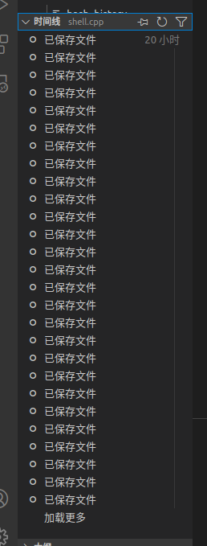

赵子毅 PB20051107
# shell

## 如何运行？

直接编译shell.cpp即可

## 选作

1. history持久化
2. 上下方向键切换history
3. EOF = exit（分数超了 但是在2的基础上这就5行就顺手做了）

## 需要注意的事项

1. 由于个人问题（傻）上下键功能实现是手写的 所以会有下面第二点的问题
2. 由于使用了system("stty raw") 很多按键都变成了转义字符需要特殊匹配。
   鉴于时间有限并且影响不大（懒) 本程序不支持**方向键左右** 当然上下是ok的

## 时间线

由于本人不太良好的编程习惯，我现在其他地方编辑好了整个程序才拷贝过来 导致commit寥寥无几

下面是我的时间线 希望助教相信我是自己写的[捂脸]

